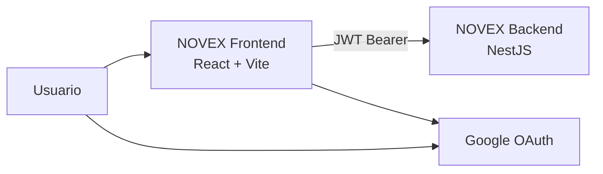
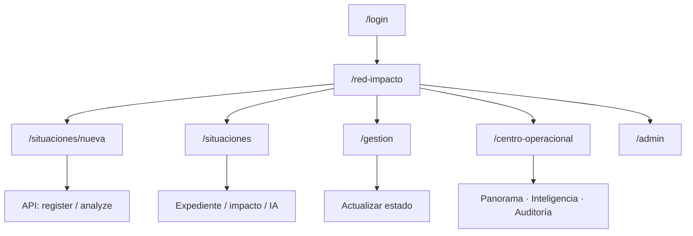

# NOVEX Frontend

**Centro de Monitoreo Operativo** — interfaz web de NOVEX para registrar, visualizar y gestionar situaciones institucionales sobre la red de coordinaciones, con inteligencia asistida y vistas ejecutivas.

[](https://nodejs.org/)
[](https://react.dev/)
[](https://vitejs.dev/)
[](https://www.typescriptlang.org/)
[](https://tailwindcss.com/)

Backend companion: [NOVEX_BACKEND](https://github.com/DesarrolloFabrica/NOVEX_BACKEND) · Cloud Run: `novex-frontend`

---

## Qué es esta aplicación

SPA en React que consume la API NOVEX para:

- autenticar usuarios (Google OAuth; login por correo solo en desarrollo);
- explorar la **Red de impacto** (coordinaciones, situaciones, simulación de impacto);
- registrar y gestionar situaciones operacionales;
- consultar análisis IA, evidencias, timeline y recomendaciones;
- ofrecer el **Centro operacional ejecutivo** (panorama, inteligencia, auditoría);
- administrar usuarios y catálogos (`ADMIN`).

---

## Arquitectura



| Capa | Tecnología |
|---|---|
| UI | React 19, TypeScript, Tailwind CSS 4 |
| Build | Vite 8 |
| Routing | React Router 7 |
| Auth cliente | `@react-oauth/google` + JWT en `localStorage` |
| Grafo / red | `@xyflow/react` |
| Motion / PDF | Motion, jsPDF |
| Estado | React Context + `useReducer` (auth, eventos) |
| Tests | Vitest · Playwright |
| Lint | Oxlint |
| Runtime prod | Nginx en Cloud Run |
| CI/CD | GitHub Actions → push a `main` |

---

## Estructura del repositorio

```text
NOVEX_FRONTEND/
├── src/
│   ├── app/                 # Shell, providers, router
│   ├── pages/               # Páginas de ruta
│   ├── modules/
│   │   ├── auth/            # Sesión, roles, login
│   │   ├── api/             # Clientes HTTP por dominio
│   │   ├── services/        # Agregación de datos
│   │   ├── situations/
│   │   ├── operational-events/
│   │   ├── impact-network/  # Experiencia Red de impacto
│   │   ├── executive-operations-center/
│   │   ├── monitoring/      # Gestión de situaciones
│   │   ├── room/
│   │   └── onboarding/
│   └── shared/              # Guards, HTTP client, UI
├── e2e/                     # Playwright
├── docker/                  # Nginx de referencia
├── scripts/                 # Dev y deploy
├── Dockerfile
└── .github/workflows/       # deploy-frontend.yml
```

---

## Roles y navegación

Códigos de rol alineados con el backend:

| Rol | Landing típica | Capacidades en UI |
|---|---|---|
| `ADMIN` | `/red-impacto` | Consola `/admin` + centro operacional |
| `DIRECTOR` | `/red-impacto` | Centro operacional, vistas de lectura |
| `ANALISTA` | `/red-impacto` | Registro/análisis + centro operacional |
| `COORDINADOR` | `/red-impacto` (con coordinación) | Operación de su área; **sin** centro ejecutivo |

Guards: `ProtectedRoute`, `RequirePermissionRoute`, `RequireRoleRoute`, `RequireSituationCreationRoute`.

---

## Rutas principales

| Ruta | Vista | Protección |
|---|---|---|
| `/login` | Login | Pública |
| `/red-impacto` | Red de impacto | `COORDINATIONS_VIEW` |
| `/dashboard` | Inteligencia operativa | `SITUATIONS_VIEW` |
| `/situaciones` | Registro de situaciones | `SITUATIONS_VIEW` |
| `/situaciones/nueva` | Wizard de captura | Puede crear situaciones |
| `/gestion` | Gestión / cola operativa | `SITUATIONS_VIEW` |
| `/centro-operacional` | Atención ejecutiva | `ADMIN` \| `DIRECTOR` \| `ANALISTA` |
| `/centro-operacional/panorama` | Panorama | Idem |
| `/centro-operacional/inteligencia` | Inteligencia IA | Idem |
| `/centro-operacional/reportes` | Auditoría (UI) | Idem |
| `/admin` | Consola administrativa | `ADMIN` |

Aliases legados (`/monitoring`, `/intelligence`, `/operational-events`, …) redirigen a las rutas actuales.

Detalle del centro ejecutivo: [`src/modules/executive-operations-center/README.md`](src/modules/executive-operations-center/README.md).

---

## Flujos de usuario



1. **Login** → Google credential → `POST /auth/google` → JWT + sesión local → landing.
2. **Registrar situación** (coordinador/analista) → wizard → API de situaciones / análisis.
3. **Explorar impacto** → grafo de coordinaciones → simulación / dossier.
4. **Gestión** → cola, filtros, cambio de estado.
5. **Centro operacional** (sin coordinador) → consolidación ejecutiva.
6. **Admin** → usuarios, roles, permisos, coordinaciones.

---

## Autenticación (cliente)

1. `VITE_GOOGLE_CLIENT_ID` es obligatorio al arrancar (`GoogleOAuthProvider`).
2. Login: `POST /auth/google` (o `/auth/email` si `VITE_ENABLE_EMAIL_LOGIN=true`).
3. Token en `localStorage` (`novex.auth.accessToken.v1`).
4. Bootstrap: `GET /auth/me` + claims JWT.
5. `apiRequest` envía `Authorization: Bearer <token>`.
6. `401` limpia sesión; logout es local (sin endpoint de logout).

> Nunca deben almacenarse secretos, credenciales o tokens reales dentro del repositorio.

---

## Ejecución local

### Prerrequisitos

- Node.js **20+**
- npm
- Backend NOVEX en ejecución (o workspace hermano)
- `VITE_GOOGLE_CLIENT_ID` configurado

### Instalación

```bash
git clone https://github.com/DesarrolloFabrica/NOVEX_FRONTEND.git
cd NOVEX_FRONTEND
cp .env.example .env
npm install
```

### Desarrollo

```bash
# Solo frontend (proxy Vite → http://127.0.0.1:3001)
npm run dev:frontend

# Con backend hermano en el workspace local
npm run dev
```

SPA local: `http://localhost:5173`

---

## Variables de entorno

Plantilla: [`.env.example`](.env.example)

| Variable | Requerida | Descripción |
|---|---|---|
| `VITE_API_BASE_URL` | Prod | URL del API incluyendo `/api/v1` |
| `VITE_API_URL` | No | Fallback legacy de base URL |
| `VITE_GOOGLE_CLIENT_ID` | Sí | Client ID OAuth de Google |
| `VITE_ENABLE_EMAIL_LOGIN` | Local | Muestra login por correo |
| `VITE_APP_NAME` | No | Metadato de build |
| `VITE_APP_ENV` | No | Metadato de entorno |

```env
VITE_API_BASE_URL=
VITE_GOOGLE_CLIENT_ID=your-google-client-id.apps.googleusercontent.com
VITE_ENABLE_EMAIL_LOGIN=false
```

En desarrollo, base URL vacía usa el proxy de Vite hacia el backend local.  
En producción, `VITE_API_BASE_URL` es obligatoria (inyección en build-time).

---

## Integración con la API

Cliente HTTP: `src/shared/api/http.ts` (`apiRequest`, `getApiBaseUrl`).

Módulos principales en `src/modules/api/`:

| Módulo | Dominio |
|---|---|
| `admin.api.ts` | users, roles, permissions, coordinations |
| `situations.api.ts` | situaciones y registro |
| `coordinations.api.ts` | catálogo, grafo, network-status |
| `analysis.api.ts` | análisis IA |
| `impact.api.ts` | impacto y simulación |
| `recommendations.api.ts` | recomendaciones |
| `timeline.api.ts` | timeline |
| `evidences.api.ts` | evidencias |

La autorización efectiva la impone el backend; el frontend oculta o redirige rutas según rol/permiso.

---

## Centro operacional e indicadores

| Vista | Pregunta que responde |
|---|---|
| `/centro-operacional` | ¿Qué exige atención y qué tan completa es la trazabilidad? |
| `.../panorama` | ¿Qué hay registrado, en qué estado y dónde se concentra? |
| `.../inteligencia` | ¿Qué concluyó la IA y dónde faltan datos? |
| `.../reportes` | ¿Quién cambió qué? (etiqueta UI: **Auditoría**) |

Datos consolidados vía `loadOperationalCenterData` (situaciones + IA + recomendaciones + impacto + timeline + evidencias), con degradación parcial tolerante a fallos.

---

## Scripts

```bash
npm run dev            # Backend + Vite (workspace)
npm run dev:frontend   # Solo Vite
npm run build          # tsc -b && vite build
npm run preview        # Vista previa del build
npm run typecheck      # Verificación de tipos
npm run lint           # Oxlint
npm run test           # Vitest (src)
npm run test:e2e       # Playwright
```

---

## Build y despliegue

```text
Push a main / workflow_dispatch
        ↓
GitHub Actions (lint · typecheck · test · build)
        ↓
Docker (Node build → Nginx Alpine)
        ↓
Artifact Registry (novex/)
        ↓
Cloud Run (candidato → smoke → promote)
```

| Ítem | Valor |
|---|---|
| Proyecto GCP | `it-fab-contenido-edu-5` |
| Región | `us-central1` |
| Servicio | `novex-frontend` |
| Trigger | Push a **`main`** o `workflow_dispatch` |
| URL prod | https://novex-frontend-smazwcaz4a-uc.a.run.app |
| Health | `GET /health` (Nginx) |

Variables `VITE_*` se inyectan en **build-time**. Guía: [DEPLOY_FRONTEND.md](DEPLOY_FRONTEND.md)

---

## Testing

```bash
npm run test         # Unitarios Vitest
npm run test:e2e     # E2E Playwright (incluye centro operacional)
npm run typecheck
npm run lint
npm run build
```

---

## Troubleshooting

| Problema | Revisar |
|---|---|
| App no arranca | `VITE_GOOGLE_CLIENT_ID` definido |
| API no responde | Backend en `:3001`; proxy Vite; `VITE_API_BASE_URL` en prod |
| CORS | Orígenes del backend (`CORS_ORIGINS`) |
| Login falla | Client ID alineado FE/BE; usuario ACTIVE en backend |
| Ruta redirige | Permisos/rol del JWT vs guards de la ruta |
| Centro operacional oculto | Esperado para `COORDINADOR` |

---

## Convenciones

- Trabajar en ramas; integrar a `main` con Pull Request (push a `main` despliega).
- Coordinar contratos y permisos con [NOVEX_BACKEND](https://github.com/DesarrolloFabrica/NOVEX_BACKEND).
- No versionar `.env`.
- Mantener guards de ruta alineados con el RBAC del backend.

---

## Documentación relacionada

| Documento | Contenido |
|---|---|
| [DEPLOY_FRONTEND.md](DEPLOY_FRONTEND.md) | Despliegue Cloud Run |
| [EOC README](src/modules/executive-operations-center/README.md) | Centro operacional ejecutivo |
| [NOVEX_BACKEND](https://github.com/DesarrolloFabrica/NOVEX_BACKEND) | API, auth, BD, IA, ops docs |

---

## Estado

Proyecto institucional **NOVEX** · SPA React en Cloud Run · mantenimiento vía PRs sobre este repositorio.
