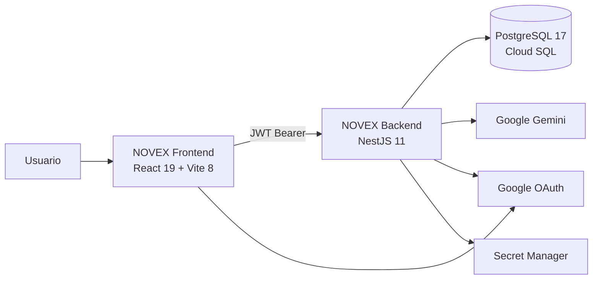

# NOVEX

> Plataforma de inteligencia operacional de la Dirección de Operaciones. Permite reportar problemas de cualquier coordinación, interpretarlos con IA, darles seguimiento y cerrarlos dejando aprendizaje institucional — todo sobre una experiencia narrativa de **cartas** y un **personaje interactivo** que expresa el estado real de la operación.

---

## Estado actual del proyecto

# AVANCE GLOBAL: **84 %**

| Indicador | Estado |
| --- | --- |
| Backend y modelo de datos | **Terminado** |
| Seguridad, RBAC y auditoría | **Cerrado (fases 1–4)** |
| Experiencia operacional (cartas + personaje) | **Funcional en producción** |
| Panel de coordinador | **Pendiente** |
| Red de impacto con datos reales | **Parcial** |
| QA integral y validación con usuarios | **Pendiente** |
| Pruebas automatizadas | **905 verdes (297 backend · 608 frontend)** |
| Despliegue | **Operativo en Cloud Run** |
| Estado de cierre | **READY FOR CONTROLLED PRODUCTION** |
| Avance total reconocido | **84 %** |

NOVEX está **construido y operando**: el ciclo completo de una situación —reportar, interpretar con IA, seguir y solucionar con aprendizaje— funciona de extremo a extremo contra el backend real, con autorización verificada en servidor y auditoría append-only.

El **16 % restante** no es una reescritura ni un cambio de arquitectura. Se reparte así:

- **7 %** — el **panel de coordinador**, que aún no se construye. Es trabajo acotado: el backend ya expone todo lo que necesita (alcance operacional, `canResolve`, resolución con aprendizaje, campos de SLA), y la narrativa de cartas y personaje ya está definida y probada, de modo que el panel se compone con piezas existentes.
- **3 %** — sustituir los datos simulados que aún alimentan la **Red de impacto** (replay y topología) y parte del resumen ejecutivo de inicio.
- **6 %** — **QA integral**: regresión, validación con usuarios reales, prueba de restore de Cloud SQL, pruebas de carga y corrección de hallazgos.

> **Mensaje de estado:** NOVEX está al **84 %**. El producto es funcional y está desplegado; lo que falta es una pantalla conocida y de baja dificultad, reemplazar los últimos datos simulados y ejecutar el aseguramiento formal de calidad.

---

## 1. ¿Qué es NOVEX?

NOVEX es la plataforma interna donde la Dirección de Operaciones de la CUN **ve y resuelve lo que se está rompiendo**, coordinación por coordinación.

Frente a un tablero tradicional, NOVEX propone una lectura distinta: la operación no se presenta como filas y KPIs, sino como una **mesa de trabajo** donde cada coordinación es una carta y un personaje encarna el estado de la Dirección. La información es la misma; lo que cambia es que se entiende de un vistazo y sin entrenamiento previo.

La plataforma permite:

- Registrar problemas operacionales desde cualquier rol, incluso sobre coordinaciones distintas a la propia.
- Interpretar cada situación con **Google Gemini**: severidad, impacto, coordinaciones potencialmente afectadas y acciones recomendadas.
- Seguir el ciclo de vida de la situación con evidencias, línea de tiempo, impacto y recomendaciones.
- **Solucionar** un problema dejando registrado el aprendizaje, acción reservada al coordinador responsable y verificada en servidor.
- Consultar la operación desde la vista ejecutiva: panorama, inteligencia y reportes exportables.
- Explorar la **Red de impacto**, la representación de las 15 coordinaciones y su propagación.
- Administrar usuarios, roles, permisos y catálogos.

---

## 2. La narrativa: cartas y personaje interactivo

Esta es la decisión de producto que distingue a NOVEX y el eje sobre el que se apoya todo lo que falta por construir.

### 2.1. La baraja de coordinaciones

Cada una de las **15 coordinaciones** es una carta con identidad visual propia —isla, color y tema de ticket—, y las cartas se despliegan en abanico sobre una mesa. El aura de cada carta comunica el estado de integridad de esa coordinación sin necesidad de leer un número.

Implementado: abanico y pila de cartas, apertura y cierre del mazo, identidad visual por coordinación, subcartas, estados de reposo y de cesión de la mesa, orientación y anclaje de paneles.

### 2.2. El personaje de la Dirección

El personaje **no es una mascota ni un asistente conversacional**: es un reactor guardián que expresa el estado operacional.

- El arte vive en un archivo **Rive** (`novex-character-v1.riv`) con su propia máquina de estados; React nunca anima la cara directamente, solo escribe al modelo de datos del personaje.
- Su expresión responde a la coordinación observada: la carta bajo el cursor o la seleccionada. Sin selección, vuelve al estado institucional en reposo.
- Acepta **reacciones puntuales** —aprobación y desaprobación— que se disparan una sola vez ante acciones del usuario.
- Bajo el personaje siempre hay una lectura textual del estado, de modo que la información no depende del canvas.

Deuda visible y documentada: el parpadeo dirigido y el seguimiento de mirada existen en el archivo Rive y están verificados, pero aún no se ha definido qué deben expresar.

### 2.3. El shell operacional

La mesa se organiza en cuatro regiones y un menú inferior:

```text
┌──────────┬──────────────┬──────────────┬─────────────┐
│personaje │ MIS REPORTES │ PROBLEMAS DE │  REPORTAR / │
├──────────┴──────────────┤ LA COORDIN.  │   DETALLE   │
│        BARAJA           │              │  + ACCIONES │
└─────────────────────────┴──────────────┴─────────────┘
                  [ menú ]
```

- **Izquierda:** lo que este usuario ha reportado, en cualquier coordinación. Es la única lista que no depende de la carta seleccionada.
- **Centro:** los problemas de la coordinación elegida, ordenados por criticidad.
- **Derecha:** donde se opera. Formulario de reporte, o detalle del problema con sus acciones.

Las dos listas abren el **mismo** detalle: no existen dos versiones del problema seleccionado.

---

## 3. Funcionalidades implementadas

### 3.1. Backend — API NestJS

27 módulos de dominio sobre PostgreSQL 17 con TypeORM (`synchronize: false`) y 12 migraciones versionadas.

| Dominio | Alcance |
| --- | --- |
| `auth` | Google OAuth + JWT, login por correo solo en desarrollo, alcance operacional por usuario |
| `users` · `roles` · `permissions` · `rbac` | RBAC resuelto **en servidor** por request, no confiado al token |
| `coordinations` | Catálogo y grafo institucional de las 15 coordinaciones |
| `situations` + `situation-*` | Ciclo de vida completo: evidencia, impacto, línea de tiempo, recomendaciones, resolución con aprendizaje y campos de SLA |
| `ai-orchestration` · `ai-analysis*` · `ai-prompt-engine` | Pipeline de análisis con Gemini, con timeout, cancelación y persistencia atómica |
| `intelligence` | Interpretación operacional derivada del análisis |
| `operational-overview` | LEVEL 0 de la experiencia de cartas: estado por coordinación en una sola petición |
| `dashboard` | Métricas agregadas |
| `audit` | Registro append-only de eventos relevantes |
| `health` | Probes `/health` y `/health/ready` |

### 3.2. Frontend — SPA React 19

| Módulo | Estado |
| --- | --- |
| `operational-cards` | **Completo** — la experiencia de cartas y personaje, con datos reales |
| `situations` · `operational-events` | Completo — registro, listado y gestión |
| `executive-operations-center` | Funcional — panorama, inteligencia y reportes; el resumen de inicio aún usa datos simulados |
| `impact-network` | Funcional en interfaz; topología y replay siguen sobre datos simulados |
| `monitoring` | Completo — cola de situaciones y consola de gestión |
| `auth` · `onboarding` | Completo — sesión, guards y recorrido guiado de primera situación |
| Consola `/admin` | Completo |

### 3.3. Flujo de resolución

Una sola petición (`POST /situations/:id/resolution`) cierra el problema con su aprendizaje. No hay transiciones intermedias artificiales ni reintento automático, para no producir conflictos confusos si la red falla después de que el servidor ya cerró el caso.

**Quién puede solucionar lo decide el backend**, no la interfaz: el detalle viaja con `canResolve`, y el servidor vuelve a comprobarlo al recibir la resolución. Ocultar el formulario es una comodidad visual, nunca la autorización.

---

## 4. Arquitectura



| Capa | Tecnología |
| --- | --- |
| Interfaz | React 19, TypeScript 6, Tailwind CSS 4 |
| Animación de personaje | Rive (WebGL2) |
| Grafo / red | `@xyflow/react` |
| Build | Vite 8 |
| API | NestJS 11 + TypeORM 0.3 |
| Base de datos | PostgreSQL 17 (Docker local / Cloud SQL) |
| IA | `@google/genai` |
| Seguridad | Helmet, Throttler, CORS, validación de entorno |
| Runtime | Cloud Run + Artifact Registry (`us-central1`) |
| CI/CD | GitHub Actions |
| Pruebas | Jest · Vitest · Playwright |

---

## 5. Roles

| Rol | Landing | Capacidades |
| --- | --- | --- |
| `ADMIN` | Centro operacional | Todo, más la consola `/admin` |
| `DIRECTOR` | Centro operacional | Panorama, inteligencia, reportes; lectura ejecutiva |
| `ANALISTA` | Centro operacional | Registro y análisis + vistas ejecutivas |
| `COORDINADOR` | Centro operacional | Operación de su coordinación; **único rol que puede solucionar**; sin acceso a las secciones ejecutivas |

La guarda de rutas opera en **dos niveles a propósito**: el layout del centro operacional admite a todos los roles operativos —incluido el coordinador, porque esa es su casa—, mientras cada sección ejecutiva conserva su propia guarda. Habilitar la pantalla operacional no abre panorama, inteligencia ni reportes.

---

## 6. Lo que falta

### 6.1. Panel de coordinador — **pendiente, baja dificultad**

Es la pieza más visible que falta y, a la vez, la menos riesgosa.

Hoy el coordinador ya aterriza en el centro operacional y puede ver los problemas de su coordinación, abrir el detalle y solucionarlos dejando aprendizaje. Lo que no existe es su **panel propio**: la vista dedicada donde vea su carga, sus plazos, lo que su coordinación tiene abierto y lo que ya cerró, en el mismo lenguaje de cartas y personaje.

Se considera acotado porque:

- El backend **no requiere trabajo nuevo**: el alcance operacional, `canResolve`, la resolución con aprendizaje, los campos de SLA y `operational-overview` ya están construidos, probados y desplegados.
- La narrativa ya está resuelta: las cartas, el abanico, los temas de ticket, los marcos de panel, las reacciones del personaje y el reductor de estado existen y tienen pruebas.
- El panel se **compone** con componentes existentes; no introduce un patrón visual nuevo.

### 6.2. Datos reales en Red de impacto

La topología, los escenarios de propagación y el replay de incidentes se alimentan de archivos simulados. La simulación de impacto sí consulta el análisis IA persistido. Falta el respaldo real del replay y del resumen ejecutivo de inicio.

### 6.3. QA integral

- Regresión completa y validación con usuarios reales de cada rol.
- **Prueba de restore de Cloud SQL**: los backups automáticos y PITR están configurados, pero el restore nunca se ejecutó.
- Pruebas de carga.
- Pentest externo.
- Corrección de hallazgos y aprobación final de cierre.

---

## 7. Desglose del avance

| Frente | Peso | Avance | Aporte |
| --- | ---: | ---: | ---: |
| Backend, API y modelo de datos | 26 % | 97 % | 25,2 |
| Seguridad, RBAC y auditoría | 10 % | 95 % | 9,5 |
| Experiencia operacional (cartas + personaje) | 20 % | 92 % | 18,4 |
| Panel de coordinador | 7 % | 20 % | 1,4 |
| Centro ejecutivo | 10 % | 85 % | 8,5 |
| Red de impacto | 7 % | 70 % | 4,9 |
| Administración, onboarding y sesión | 6 % | 92 % | 5,5 |
| Despliegue, CI/CD y observabilidad | 8 % | 90 % | 7,2 |
| QA integral y validación con usuarios | 6 % | 60 % | 3,6 |
| **Total** | **100 %** | | **84,2 → 84 %** |

---

## 8. Verificación ejecutada

Estado comprobado sobre el árbol de trabajo actual, con ambos repositorios limpios:

| Verificación | Resultado |
| --- | --- |
| `npm test` backend (Jest) | **297 / 297** en 34 suites |
| `npm test` frontend (Vitest) | **608 / 608** en 67 archivos |
| Especificaciones Playwright | 27 archivos E2E |
| `npm run build` backend y frontend | OK |
| Migraciones | 12, versionadas, aditivas e idempotentes |
| CI bloqueante | lint + pruebas + `test:security` |

El cierre técnico formal (fases 1–4 de hardening) dictaminó **`READY FOR CONTROLLED PRODUCTION`**: no se emitió un `READY FOR PRODUCTION` absoluto porque persisten verificaciones externas —restore de Cloud SQL y pentest— que no dependen del código.

---

## 9. Despliegue

Proyecto GCP `it-fab-contenido-edu-5`, región `us-central1`. Dos servicios de Cloud Run: `novex-backend` y `novex-frontend`, construidos desde la rama de trabajo `feat/admin-operational-cards-mvp`.

`migrationsRun` está en `false`: las migraciones **no** corren solas al arrancar, se ejecutan de forma deliberada. El esquema es compatible hacia atrás, de modo que revertir una revisión de Cloud Run basta como rollback, sin deshacer la base de datos.

---

## 10. Riesgos abiertos

| Riesgo | Mitigación |
| --- | --- |
| Restore de Cloud SQL nunca probado | Ejecutar el checklist de restore sobre una instancia temporal antes del cierre |
| Sin pentest externo | Agendar dentro de la ventana de QA |
| Red de impacto sobre datos simulados | Puede confundirse con información real; etiquetar o conectar antes de exponerla a dirección |
| Trabajo fuera de `main` | Ambos repositorios operan en `feat/admin-operational-cards-mvp`; planificar la integración |
